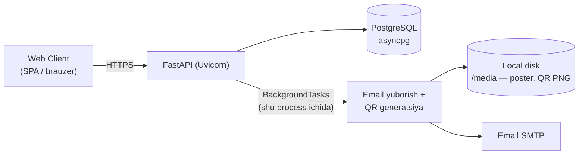
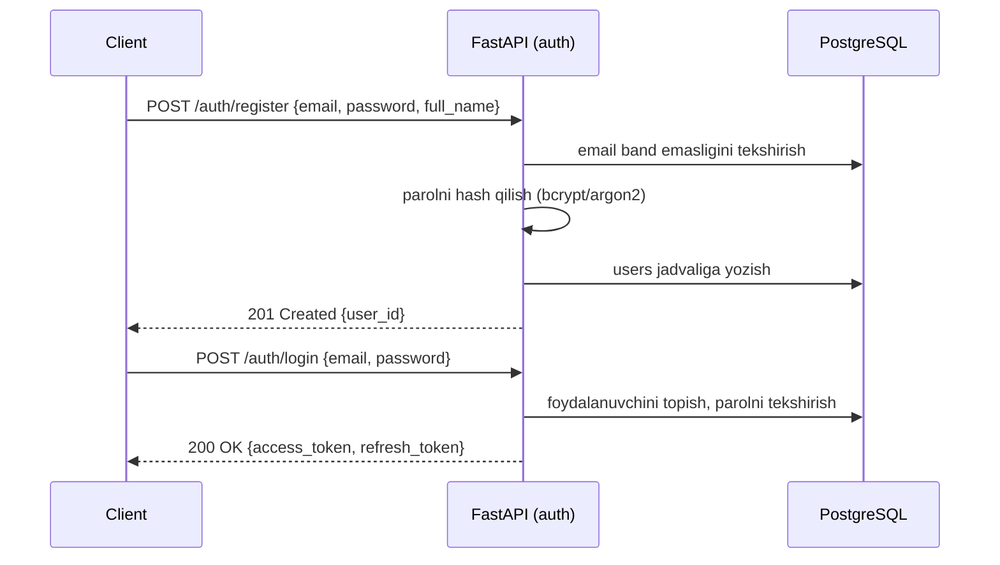
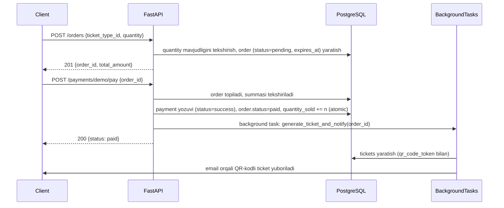
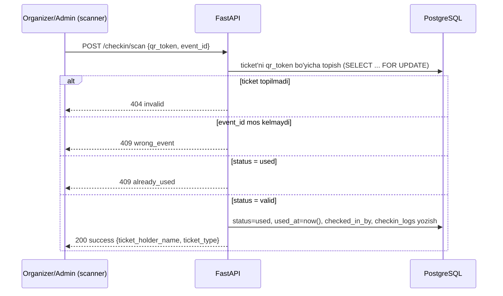

# 02 — Texnik arxitektura

> MVP uchun arxitektura ataylab **minimal** tutilgan: bitta FastAPI process, bitta PostgreSQL baza, qo'shimcha infratuzilma (Redis, alohida worker, tashqi to'lov API) yo'q. Bu talabaga butun oqimni (so'rov → biznes logika → DB → javob) bitta process ichida to'liq kuzatish imkonini beradi.

## 1. Umumiy komponentlar diagrammasi



**Komponentlar tavsifi:**

| Komponent | Vazifasi |
|---|---|
| FastAPI (Uvicorn) | Yagona backend server — barcha so'rovlarni qabul qiladi va javob qaytaradi |
| PostgreSQL (asyncpg) | Yagona ma'lumotlar bazasi |
| FastAPI `BackgroundTasks` | So'rov javob qaytargandan keyin, **shu process ichida**, qo'shimcha vazifalarni bajaradi (email yuborish, QR generatsiya) — alohida worker/queue kerak emas |
| Local disk (`/media`) | Event poster rasmlari va generatsiya qilingan QR PNG fayllari |
| Email SMTP | Bildirishnoma yuborish uchun oddiy SMTP (dev'da Mailhog/console orqali ham tekshirish mumkin) |

> 🎓 **Bonus**: loyiha kattalashsa (yuzlab bir vaqtdagi email/QR so'rovi bo'lsa), `BackgroundTasks` o'rniga Redis + ARQ/Celery kabi alohida navbat (queue) tizimiga o'tish mumkin — bu real production loyihalarda keng qo'llaniladi, lekin MVP hajmida ortiqcha murakkablik.

## 2. Nima uchun `BackgroundTasks` yetarli?

FastAPI'ning o'rnatilgan [`BackgroundTasks`](https://fastapi.tiangolo.com/tutorial/background-tasks/) — so'rovga javob qaytarilgandan **keyin**, lekin hali shu process ichida bajariladigan funksiya. Masalan:

```python
@router.post("/payments/demo/pay")
async def pay(order_id: UUID, background_tasks: BackgroundTasks, ...):
    # ... to'lovni tasdiqlash, order.status = "paid" ...
    background_tasks.add_task(generate_ticket_and_notify, order_id)
    return {"status": "paid"}
```

Bu MVP uchun yetarli: alohida Redis, worker process, deployment murakkabligi kerak emas. Kamchiligi — agar server qayta ishga tushib qolsa, bajarilmagan background task yo'qoladi (production'da bu muammo, lekin o'quv loyihasi uchun muhim emas).

## 3. Qatlamli arxitektura (har bir domain ichida)

```
Router (FastAPI endpoint)
   │  — HTTP so'rov/javob, Pydantic schema validatsiyasi
   ▼
Service (biznes logika)
   │  — qoidalar, tranzaksiyalar, boshqa service'larni chaqirish
   ▼
Repository (DB access)
   │  — SQLAlchemy so'rovlari, CRUD
   ▼
Model (SQLAlchemy ORM)
```

- **Router** — faqat HTTP qatlami: request qabul qilish, dependency orqali auth/DB session olish, service chaqirish, response qaytarish.
- **Service** — biznes qoidalar shu yerda (masalan: "order yaratishda ticket miqdori yetarli ekanligini tekshirish").
- **Repository** — faqat ma'lumotlar bazasi bilan ishlash (query'lar).
- **Schemas** (Pydantic v2) — request/response validatsiyasi.

Batafsil papka strukturasi: [[09-project-structure.md]]

## 4. Fayl saqlash

- Event poster rasmlari va QR PNG fayllari **local disk**da (`./media/`) saqlanadi, FastAPI static mount orqali uzatiladi.
- 🎓 **Bonus**: production'ga chiqarilganda S3/MinIO kabi object storage'ga o'tish tavsiya etiladi (disk serverga bog'lab qo'ymaslik uchun).

## 5. Logging

- Oddiy Python o'rnatilgan `logging` moduli yetarli — har bir muhim amal (order yaratildi, to'lov o'tdi, check-in bo'ldi) log qilinadi.
- 🎓 **Bonus**: production'da `structlog` (structured JSON log) va Sentry (xatoliklarni avtomatik yig'ish) qo'shiladi.

## 6. Asosiy oqimlar — sequence diagramlar

### 6.1. Ro'yxatdan o'tish



### 6.2. Ticket sotib olish + demo to'lov



### 6.3. QR check-in



## Bog'liq hujjatlar

[[03-database-schema.md]] · [[06-payment-integration.md]] · [[09-project-structure.md]] · [[10-non-functional-requirements.md]]
