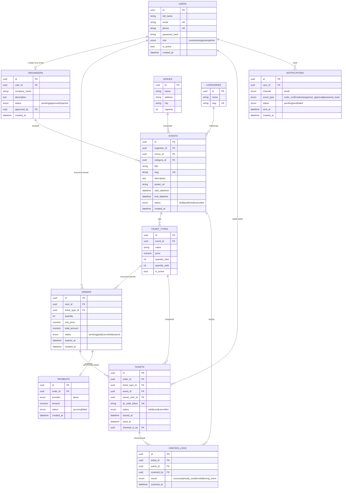

# 03 — Ma'lumotlar bazasi sxemasi (DB Schema / ERD)

> Soddalashtirilgan MVP versiyasi: bir buyurtma = bitta ticket_type + miqdor (cart/multi-item yo'q), shu sababli alohida `order_items` jadvali yo'q — uning maydonlari to'g'ridan-to'g'ri `orders` jadvalida.

## 1. ERD (Entity-Relationship Diagram)



## 2. Jadvallar bo'yicha izohlar

| Jadval | Tavsif |
|---|---|
| `users` | Barcha foydalanuvchilar (customer/organizer/admin) bitta jadvalda, `role` maydoni orqali farqlanadi ([[05-rbac.md]]) |
| `organizers` | `users`ga 1:1 bog'langan, faqat `organizer` bo'lishga ariza topshirgan foydalanuvchilar uchun qo'shimcha profil |
| `venues` | Event o'tkaziladigan joylar |
| `categories` | Event toifalari (concert, theater, sport...) |
| `events` | Asosiy event ma'lumotlari |
| `ticket_types` | Har bir event uchun bir nechta ticket turi (VIP, Standard...), narx va miqdor shu yerda |
| `orders` | Foydalanuvchi buyurtmasi — **bitta ticket_type + miqdor** (MVP'da cart yo'q) |
| `tickets` | Har bir sotilgan bitta chipta — noyob QR token bilan; bitta `order` (agar `quantity > 1` bo'lsa) bir nechta `ticket` yaratadi |
| `payments` | To'lov yozuvi — MVP'da faqat `provider = "demo"` |
| `notifications` | Yuborilgan/yuborilishi kerak bo'lgan email bildirishnomalar tarixi |
| `checkin_logs` | Har bir skan urinishi — audit va statistika uchun |

> 🎓 **Bonus**: real loyihada bitta buyurtmada bir nechta xil ticket_type sotib olish kerak bo'lsa, `order_items` jadvali qo'shiladi (`orders 1—N order_items N—1 ticket_types`), `orders`dan `ticket_type_id/quantity/unit_price` shu jadvalga ko'chadi.

## 3. Muhim dizayn qarorlari

1. **Barcha PK'lar UUID** — public API'da resurslar sonini oshkor qilmaslik va taxmin qilib bo'lmaslik uchun.
2. **`tickets.qr_code_token`** — oddiy UUID emas, `secrets.token_urlsafe(32)` kabi kriptografik jihatdan taxmin qilib bo'lmaydigan token. Batafsil: [[07-qr-checkin.md]].
3. **Oversell'ning oldini olish**: to'lov muvaffaqiyatli bo'lganda `ticket_types.quantity_sold` atomic tarzda yangilanadi:
   ```sql
   UPDATE ticket_types
   SET quantity_sold = quantity_sold + :n
   WHERE id = :ticket_type_id
     AND quantity_sold + :n <= quantity_total;
   ```
   Agar 0 qator yangilansa — yetarli joy yo'q, to'lov muvaffaqiyatsiz deb belgilanadi.
4. **`orders.unit_price`** — order yaratilgan paytdagi narx saqlanadi (snapshot), `ticket_types.price` keyin o'zgarsa ham eski buyurtma narxi o'zgarmaydi.
5. **Enum maydonlar** — boshlang'ich bosqichda oddiy `VARCHAR + CHECK constraint` sifatida amalga oshirish tavsiya etiladi (PostgreSQL native `ENUM` turini keyinchalik o'zgartirish qiyinroq).

## 4. Indekslar

| Jadval | Indeks | Sabab |
|---|---|---|
| `events` | `(status, start_datetime)` | Public listing — faqat published va sana bo'yicha saralash |
| `events` | `slug` (unique) | URL orqali qidiruv |
| `orders` | `(user_id, status)` | Foydalanuvchi buyurtmalar tarixi |
| `tickets` | `qr_code_token` (unique) | Check-in paytida tez va noyob qidiruv |
| `ticket_types` | `event_id` | Event bo'yicha ticket turlarini olish |

## 5. Alembic migratsiyalar

- Fayl nomlash: `YYYYMMDD_HHMM_qisqa_tavsif.py`.
- Har bir migratsiya faqat bitta mantiqiy o'zgarish qilishi kerak.
- `alembic revision --autogenerate` orqali generatsiya qilinadi, lekin har doim qo'lda tekshiriladi.

## Bog'liq hujjatlar

[[04-api-specification.md]] · [[06-payment-integration.md]] · [[07-qr-checkin.md]] · [[09-project-structure.md]]
