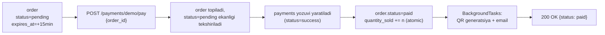

# 06 — To'lov integratsiyasi

> MVP uchun haqiqiy Payme/Click integratsiyasi o'rniga **demo (mock) to'lov provayderi** ishlatiladi. Sabab: real integratsiya sandbox hisob, tashqi API, JSON-RPC/webhook va imzo tekshiruvini talab qiladi — bu MVP bosqichida asosiy oqim (order → payment → ticket)ni o'rganishga xalaqit beradi. Demo provider bilan talaba butun oqimni tashqi bog'liqliksiz to'liq qurib, ishlatib ko'ra oladi.

## 1. Demo Payment Provider — qanday ishlaydi



Qadamlar (hammasi **bitta HTTP so'rov** ichida, tashqi webhook yo'q):

1. Foydalanuvchi `POST /orders` orqali buyurtma yaratadi → `orders.status = pending`, `expires_at = now() + 15 min`.
2. Foydalanuvchi `POST /payments/demo/pay {order_id}` chaqiradi ("to'lov qilish" tugmasi).
3. Backend:
   - order'ni topadi, `status == pending` va `expires_at` o'tmaganini tekshiradi;
   - `payments` jadvaliga `provider="demo", status="success"` yozuv qo'shadi;
   - `orders.status = paid` qiladi;
   - `ticket_types.quantity_sold`ni **atomic** oshiradi (oversell tekshiruvi bilan — pastda);
   - `BackgroundTasks` orqali ticket+QR generatsiya va email yuborishni navbatga qo'yadi;
   - `{"status": "paid"}` javobini qaytaradi.

```python
@router.post("/payments/demo/pay")
async def demo_pay(
    data: DemoPayRequest,
    background_tasks: BackgroundTasks,
    user: User = Depends(get_current_user),
    session: AsyncSession = Depends(get_db_session),
):
    order = await order_service.mark_as_paid(session, data.order_id, user)
    background_tasks.add_task(ticket_service.generate_and_notify, order.id)
    return {"status": "paid", "order_id": order.id}
```

> 💡 O'quv maqsadida `demo_pay` ichiga ataylab tasodifiy muvaffaqiyatsizlik qo'shish mumkin (masalan 10% ehtimol bilan `status="failed"`) — shunda talaba xato holatini (`orders.status` `paid`ga o'tmasligi) ham qo'lda sinab ko'radi.

## 2. Oversell oldini olish (asosiy DB darsi shu yerda)

```sql
UPDATE ticket_types
SET quantity_sold = quantity_sold + :n
WHERE id = :ticket_type_id
  AND quantity_sold + :n <= quantity_total;
```

Agar 0 qator yangilansa — yetarli joy yo'q, to'lov `failed` deb belgilanadi. Bu — bir nechta foydalanuvchi bir vaqtda oxirgi joylarni sotib olishga uringanda **race condition**ning oldini qanday olish mumkinligini ko'rsatadigan yaxshi amaliy misol.

## 3. Order expiration

- To'lanmagan (`status=pending`) va `expires_at` o'tib ketgan orderlar uchun sodda yechim: har safar foydalanuvchi o'z orderlarini ko'rganda (`GET /orders`) yoki to'lovga urinishda (`POST /payments/demo/pay`) `expires_at` tekshiriladi — agar o'tgan bo'lsa, `status=expired` qilib qo'yiladi ("lazy expiration", alohida scheduler kerak emas).
- 🎓 **Bonus**: davriy fon job (masalan APScheduler yoki cron) orqali barcha muddati o'tgan orderlarni avtomatik yopib chiqish.

## 4. 🎓 Bonus: Payme/Click integratsiyasi (keyingi bosqich)

MVP tugagach, demo provider o'rniga (yoki qo'shimcha ravishda) haqiqiy to'lov tizimlarini ulash mumkin. Qisqacha yo'nalish:

- **Payme**: JSON-RPC 2.0 protokoli, `POST /webhooks/payme` bitta endpoint orqali. Majburiy metodlar: `CheckPerformTransaction`, `CreateTransaction`, `PerformTransaction`, `CancelTransaction`, `CheckTransaction`. Autentifikatsiya — HTTP Basic Auth (`Paycom:merchant_key`).
- **Click**: ikki bosqichli webhook — `POST /webhooks/click/prepare` va `POST /webhooks/click/complete`. Har bir so'rov `MD5(click_trans_id + service_id + SECRET_KEY + merchant_trans_id + amount + action + sign_time)` imzosi orqali tekshiriladi.
- Ikkalasida ham **idempotentlik** muhim: webhook qayta kelishi mumkin, shuning uchun `payments.provider_transaction_id` ustida `UNIQUE` constraint va oldin ishlov berilgan tranzaksiyani qayta ishlamaslik kerak.
- Bu integratsiyani qo'shishda `payments.provider` enumiga `payme`/`click` qo'shiladi, `demo_pay` endpointi o'rniga `payments/{provider}/create` + webhook handlerlar yoziladi — lekin oversell va order-status logikasi (yuqoridagi §2-3) deyarli o'zgarishsiz qoladi, chunki bu qism to'lov provayderidan mustaqil.

## Bog'liq hujjatlar

[[03-database-schema.md]] · [[04-api-specification.md]] · [[07-qr-checkin.md]] · [[12-roadmap.md]]
