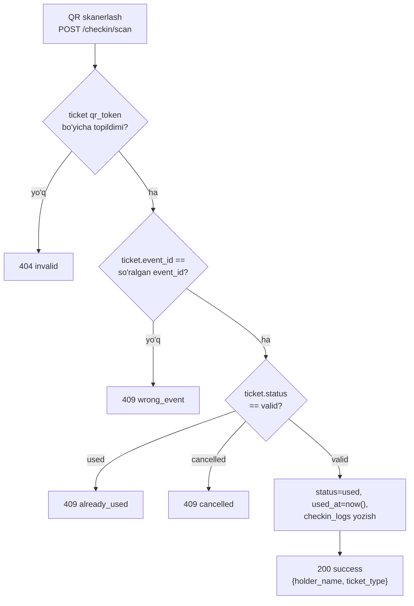

# 07 — QR check-in oqimi

## 1. QR-kod tarkibi va generatsiyasi

- QR-kod ichida ticket'ning **xom `id`si emas**, balki alohida `qr_code_token` maydoni kodlanadi — bu maydon:
  - Kriptografik jihatdan taxmin qilib bo'lmaydigan (masalan `secrets.token_urlsafe(32)`), **yoki**
  - HMAC bilan imzolangan payload (`ticket_id + secret_key` asosida hisoblangan imzo) — bu variant offline tekshirish imkonini beradi, lekin MVP uchun oddiy random token yetarli.
- Demo to'lov muvaffaqiyatli bo'lgach ([[06-payment-integration.md]]), FastAPI `BackgroundTasks` orqali (alohida worker/queue emas, shu process ichida) har bir sotib olingan ticket uchun:
  1. `tickets` jadvaliga yozuv yaratiladi (`qr_code_token` generatsiya qilinadi, `status=valid`).
  2. `qrcode` Python kutubxonasi orqali PNG rasm generatsiya qilinadi (token matnini kodlab).
  3. Rasm local disk (`/media`) ga saqlanadi, URL saqlanadi (yoki rasm to'g'ridan-to'g'ri email'ga ilova qilinadi).

## 2. Yetkazish

- **Email**: buyurtma tasdig'i email'iga QR-kod(lar) ilova (attachment) yoki inline rasm sifatida yuboriladi ([[08-notifications.md]]).
- **Dashboard**: foydalanuvchi `GET /tickets/{id}/qr` orqali istalgan vaqt QR-kodni qayta ko'ra oladi (masalan telefon ekranida ko'rsatish uchun).

## 3. Validatsiya oqimi (`POST /checkin/scan`)

**Kirish**: `{qr_token: string, event_id: uuid}`



Har bir natija (muvaffaqiyatli yoki xato) `checkin_logs` jadvaliga yoziladi — audit va statistika uchun.

## 4. Concurrency (bir vaqtda ikki marta skanerlash)

Bir xil ticket ikki turli qurilmada bir vaqtning o'zida skanerlanishi mumkin (masalan ikkita kirish eshigi). Buning oldini olish uchun:

```sql
BEGIN;
SELECT * FROM tickets WHERE qr_code_token = :token FOR UPDATE;
-- status tekshiriladi, agar valid bo'lsa -> used ga o'tkaziladi
UPDATE tickets SET status='used', used_at=now(), checked_in_by=:user_id WHERE id = :ticket_id;
INSERT INTO checkin_logs (...);
COMMIT;
```

`FOR UPDATE` lock ikkinchi so'rovni birinchisi commit bo'lgunga qadar kutishga majbur qiladi — shu orqali ikkalasi ham "success" deb hisoblanishining oldi olinadi.

## 5. Xavfsizlik

- `/checkin/scan` faqat `organizer` (o'z eventiga) yoki `admin` (istalgan eventga) uchun ochiq — [[05-rbac.md]].
- Ownership tekshiruvi: `event.organizer_id == current_user.organizer_id`, aks holda `403`.
- `qr_code_token` hech qachon API javoblarida (masalan event/ticket list endpointlarida) oshkor qilinmaydi — faqat egasi `GET /tickets/{id}/qr` orqali oladi.
- 🎓 **Bonus**: `/checkin/scan` uchun rate limiting (masalan `slowapi`) — brute-force token qidirish ehtimolini kamaytirish uchun, production'da tavsiya etiladi.

## 6. Statistika

- `GET /checkin/events/{event_id}/stats` — jami sotilgan ticketlar soni, nechtasi check-in qilingani, foiz (organizer uchun real-time monitoring).
- `GET /checkin/events/{event_id}/logs` — barcha skan urinishlari tarixi (kim, qachon, natija).

## 7. MVP scope chegarasi

- Faqat **online** skanerlash (backend har doim mavjud internet orqali chaqiriladi) — offline-first mobil skaner (internetsiz ishlash + keyin sync) keyingi fazaga qoldiriladi.
- Skaner UI alohida native mobil ilova emas, balki web-based kamera skaner (brauzerda) sifatida MVP'da yetarli.

## Bog'liq hujjatlar

[[03-database-schema.md]] · [[04-api-specification.md]] · [[06-payment-integration.md]] · [[10-non-functional-requirements.md]]
