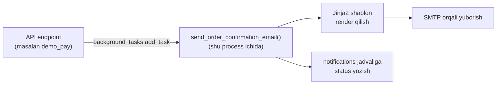

# 08 — Bildirishnoma oqimi (Email)

> MVP uchun faqat **email** kanali. Yuborish alohida Redis/worker orqali emas, FastAPI `BackgroundTasks` yordamida — bu shu process ichida, so'rov javob qaytargandan keyin bajariladigan sodda usul.

## 1. Trigger'lar (qachon email yuboriladi)

| Event turi | Trigger | Qabul qiluvchi |
|---|---|---|
| `order_confirmation` | Demo to'lov muvaffaqiyatli bo'lganda (`orders.status → paid`) | Xaridor — buyurtma tafsilotlari + QR-kodli ticketlar |
| `organizer_approval` | Admin organizer arizasini tasdiqlaganda/rad etganda | Ariza topshirgan foydalanuvchi |
| `password_reset` 🎓 | Foydalanuvchi parolni tiklashni so'raganda | So'ragan foydalanuvchi |

> 🎓 **Bonus**: `event_reminder` (event boshlanishidan ~24 soat oldin eslatma) — bu davriy fon vazifasi (scheduler/cron: masalan APScheduler yoki ARQ) talab qiladi, shuning uchun MVP'dan chiqarilgan. Keyingi bosqichda qo'shish mumkin.

## 2. Arxitektura

- Email yuborish **hech qachon** API javobini bloklamaydi — endpoint `background_tasks.add_task(send_order_confirmation_email, order_id)` chaqiradi va darhol javob qaytaradi, email esa fonda yuboriladi.
- Har bir yuborish urinishi `notifications` jadvaliga yoziladi (`status: pending → sent/failed`) — kelajakda kuzatish va debug uchun.

## 3. Shablonlar

- Jinja2 orqali oddiy HTML email shablonlari: `order_confirmation.html`, `organizer_approval.html`.
- QR-kod rasmi `order_confirmation` shablonida ilova (attachment) sifatida qo'shiladi.

## 4. Xatolik

- Agar SMTP xatosi bo'lsa, `notifications.status = failed` deb belgilanadi va oddiy `logging` orqali log qilinadi.
- 🎓 **Bonus**: eksponensial backoff bilan avtomatik qayta urinish (retry) — bu odatda alohida queue tizimi (Redis+ARQ/Celery) bilan birga qo'shiladi.

## 5. Konfiguratsiya

- `.env`: `SMTP_HOST`, `SMTP_PORT`, `SMTP_USER`, `SMTP_PASSWORD`, `EMAIL_FROM`.
- Dev muhitda haqiqiy email yuborish o'rniga [Mailhog](https://github.com/mailhog/MailHog) (local SMTP-catcher) yoki konsolga chiqarib tekshirish tavsiya etiladi — shunda talaba SMTP hisob ochmasdan email oqimini sinab ko'ra oladi.

## Bog'liq hujjatlar

[[01-prd.md]] · [[02-architecture.md]] · [[06-payment-integration.md]] · [[12-roadmap.md]]
